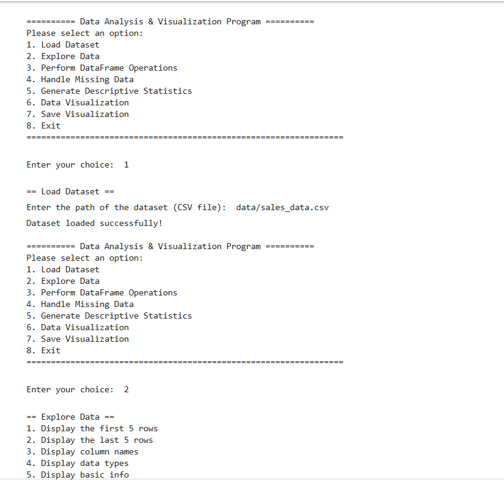
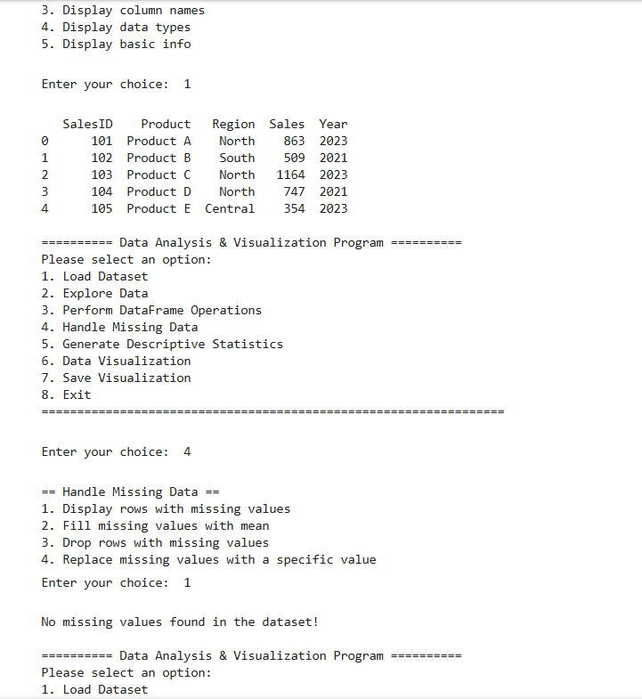
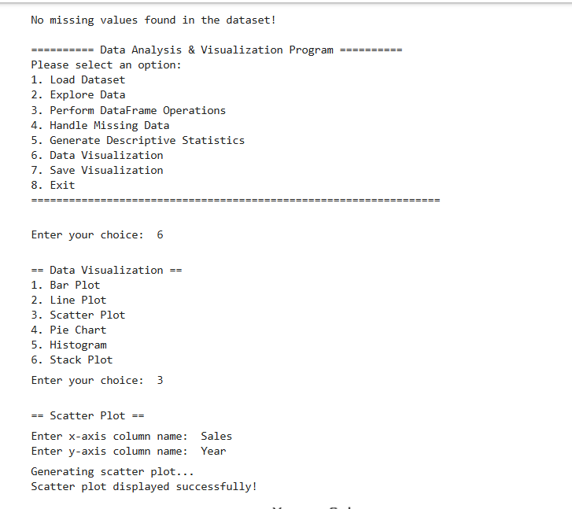

# 📊 PR9 – Pandas Analyzer & Data Visualization

## 📝 Description

Sales Data Analysis & Visualization is a menu-driven Python project designed to analyze and visualize sales data from a CSV file. It uses Pandas for data loading, cleaning, manipulation, and analysis, while Matplotlib and Seaborn are used to create different visualizations and understand sales patterns. The project provides a simple console-based interface for performing various data analysis tasks.

## ✨ Features

- 📂 Load sales data from a CSV file
- 🔍 Explore data using `head()`, `tail()`, column names, data types, and `info()`
- 🧮 Perform DataFrame operations:
  - Calculate total sales
  - Add a new column
  - Sort and filter sales
  - Search for products
- 🧹 Handle missing data:
  - Display missing rows
  - Fill missing numeric values with mean
  - Drop missing rows
  - Replace missing values
- 📈 Generate descriptive statistics:
  - Average, maximum, and minimum sales
  - Region-wise total sales
- 📊 Create visualizations:
  - Bar Plot
  - Line Plot
  - Scatter Plot
  - Pie Chart
  - Histogram
  - Stack Plot
- 💾 Save the latest visualization as an image
- 🛡️ Includes basic exception handling

## 🛠️ Technologies Used

- 🐍 **Python**
- 🐼 **Pandas**
- 📉 **Matplotlib**
- 📊 **Seaborn**

## 📁 Project Structure

```text
Sales-Data-Analysis/
├── data/
  ├── sales_data.csv
├── main.ipynb
├── scatter_plot.png
└── README.md
```

## ⚙️ Installation

```bash
pip install pandas matplotlib seaborn
```

## ▶️ How to Run

```bash
python main.ipynb
```

Then use the menu to load, explore, clean, analyze, visualize, and save sales data.

## 📋 Main Menu

```text
1. Load Dataset
2. Explore Data
3. Perform DataFrame Operations
4. Handle Missing Data
5. Generate Descriptive Statistics
6. Data Visualization
7. Save Visualization
8. Exit
```

**Video Link:**
video Link:[https://drive.google.com/file/d/1Yth_OdbxUSAgY-sxppRUJbIMZZY1-c5U/view?usp=sharing]

---

## 📸 Output Screenshots




---

## 🗃️ Dataset

The program uses sales data with columns such as:

`SalesID`, `Product`, `Region`, `Sales`, `Year`


## 🎓 Learning Outcomes

* 🐍 Improved Python programming and OOP concepts
* 🐼 Learned practical use of Pandas for data analysis and manipulation
* 🧹 Learned data cleaning and missing value handling
* 📊 Gained experience in Matplotlib and Seaborn for data visualization
* 📈 Practiced descriptive statistics and DataFrame operations
* 💾 Learned to save and manage visualization outputs
* 🛡️ Improved exception handling and menu-driven program development
